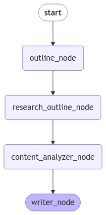
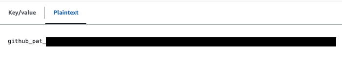
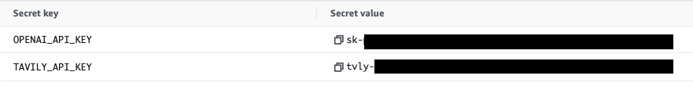

# Truth Seeker

"Truth Seeker" is a serverless application designed to generate reliable responses based on user queries, focusing on fact-checking and information verification. Leveraging technologies such as OpenAI and Tavily API, combined with the robust infrastructure of AWS Lambda, AWS Secrets Manager, and AWS Amplify, this application ensures a scalable, secure, and efficient solution.


[](./truth-seeker.png)
[](./truth-seeker-response.png)


## Key Features

- **Serverless Architecture**: Utilizes AWS Lambda for scalable and cost-effective compute power.
- **Secure Data Management**: Employs AWS Secrets Manager for secure handling of sensitive information.
- **Modern Frontend**: Built with AWS Amplify for seamless deployment and hosting.
- **Advanced AI Integration**: Integrates OpenAI and Tavily API for  query processing and response generation.
- **Automated Information Gathering**: Implements a agent using [LangGraph](https://langchain-ai.github.io/langgraph/) to search the internet, gather relevant information, and generate comprehensive articles.

[](./agent-graph.png)


## Table of Contents

- [Prerequisites](#prerequisites)
- [Development](#development)
- [Configuration](#configuration)
- [Deployment](#deployment)
- [License](#license)

## Prerequisites

- Python 3.11 or higher
- Docker
- OpenAI API key
- Tavily API key
- AWS CLI configured with appropriate permissions
- AWS SAM CLI (for local development and deployment)
- Node.js and npm (for frontend development)


## Development

### Backend

You can test the Lambda function locally using the AWS SAM CLI.

1.  Clone the repository:

    ```bash
    git clone https://github.com/your-repo/truth-seeker.git
    cd truth-seeker/backend
    ```

2. Start the local API:

    ```bash
    sam local start-api
    ```

3. Build the application:

    ```bash
    sam build --use-container
    ```

3. Create a file `backend/.env.json` and add your OpenAI and Tavily API keys:

    *backend/.env.json*
    ```
    {
        "GenerateResponse": {
            "OPENAI_API_KEY": your OpenAI API key,
            "TAVILY_API_KEY": your TAVILY API key
        }
    }
    ```
4. Invoke the function locally:

    ```bash
    sam local invoke "GenerateResponse" --env-vars .env.json -e src/generate_response/events/event.json
    ```

### Frontend

The frontend is a React application located in the `frontend` directory. It allows users to interact with the backend Lambda function.


1. Navigate to the `frontend` directory:
    ```bash
    cd truth-seeker/frontend
    ```
2. Install the dependencies

    ```bash
    npm install
    ```

3. Start the development server:

    ```bash
    npm run dev
    ```

4. Start the tailwind build process:
    ```bash
    npx tailwindcss -i ./src/index.css -o ./src/output.css --watch
    ```

5. (Optional) Create file `frontend/.env` and set environmental variables to communicate with deployed API Gateway [see](#deployment):

    *frontend/.env*
    ```
    VITE_API_ENDPOINT= your ApiGatewayBaseUrl
    VITE_REGION= your region
    ```
## Configuration

The application uses a configuration file `config.py` to manage settings:

```python
DEBUG_MODE = True  # Set to False in production
```

## Deployment

You can deploy the application using the AWS SAM CLI.

### To set up Amplify Hosting:

1. Fork this GitHub repository and take note of your `Git repository URL`, for example https://github.com/your-repo/truth-seeker/.

2. Create a GitHub fine-grained access token for the new repository by following [this](https://docs.aws.amazon.com/amplify/latest/userguide/setting-up-GitHub-access.html) guide. For the Repository permissions, select Read and write for Content and Webhooks.

3. Create a new secret called `truth-seeker-github-token` in AWS Secrets Manager and input your fine-grained access token as plaintext. Select the Plaintext tab.




### To deploy using SAM CLI:

1. Create a new secret in AWS Secrets Manager and input your OpenAI and Tavily API keys and take note of the `secret name`.



2. Clone the forked repository:

    ```bash
    git clone https://github.com/your-repo/truth-seeker.git
    cd truth-seeker/backend
    ```

2. Build using SAM:

    ```bash
    sam build --use-container
    ```

3. Deploy using SAM:

    ```bash
    sam deploy --guided
    ```

    1. For Stack Name, choose `truth-seeker`
    2. Specify the URL of the forked `Git repository URL` containing the application code.
    3. Specify the `secret name`.
    4. For the remaining options, keep the defaults by pressing the enter key.

    AWS SAM will now provision the AWS resources defined in the `backend/template.yaml` template. Once the deployment is completed successfully, you will see an output value `ApiGatewayBaseUrl`.

4.  Navigate to the Amplify console to check the build status. If the build does not start automatically, trigger it through the Amplify console.

### Increase timeout limits

You can follow [this](https://youtu.be/kzHhJ32x08k?si=iq3zA-P4AU1YE9I6) video guide.

1. In the `AWS Service Quotas` console, navigate to `Amazon API Gateway` and increase `Maximum integration timeout in milliseconds` to 100,000ms.

2. In the `API Gateway` console, navigate `TruthSeekerRestApi -> /generate_response -> GET` and increase `Integration Request timeout` to 100,000ms.

3. Deploy API to the stage `dev` to upload changes.


## License
This library is licensed under the MIT-0 [License](./LICENSE.txt). See the LICENSE file.